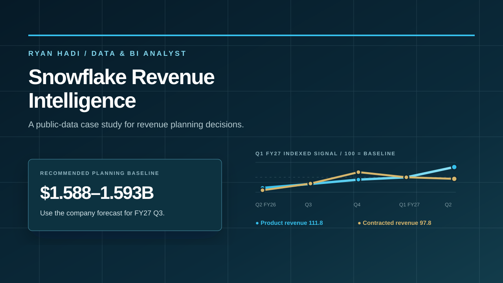

# Snowflake Revenue Intelligence

An executive-facing revenue and retention case study by [Ryan Hadi](https://www.linkedin.com/in/ryanhadi/).

The project turns public Snowflake disclosures into a clear planning recommendation. It separates what has already been reported, what management expects, and what an independent analyst hypothesis suggests.

**Live demo:** [snowflake-revenue-retention-intelli.vercel.app](https://snowflake-revenue-retention-intelli.vercel.app/)



## Executive question

Should the next-quarter operating plan use the company forecast or the higher independent estimate as its baseline?

## Recommendation

Use Snowflake's company forecast range of **$1.588–1.593B** as the FY27 Q3 planning baseline. Keep the **$1.64B** independent estimate as an upside scenario until a reported result validates it.

## What the analysis found

- Product revenue reached **$1.492B**, up **37% year over year**.
- Product revenue increased **11.8% sequentially**, while contracted future revenue decreased **2.2% sequentially**.
- Net revenue retention was **126%** and the number of customers above $1M reached **828**.
- The key operating question is whether new contracts catch up with usage and expansion growth.

## What this project demonstrates

- Framing a business question before building a chart.
- Defining metrics so reported revenue, contracted future revenue, and retention are not mixed.
- Comparing an official company forecast with a separate analyst hypothesis.
- Turning a signal into ranked priorities, owners, and decision triggers.
- Making sources, assumptions, validation, and limitations visible.

## Technical proof

The repository is intentionally inspectable rather than a screenshot-only showcase:

- `technical/analysis.sql` reproduces the sequential-growth, year-over-year, Q1-index, and scenario calculations from the snapshot.
- `artifacts/fy27-q2-metric-snapshot.csv` is the normalized metric input used by the analysis.
- `artifacts/forecast-scenarios.csv` makes the actual, company forecast, and independent estimate explicit as different evidence types.
- `technical/architecture.md` documents the source-to-decision flow and the production extension path.

The SQL uses an inline `VALUES` block so it can be inspected or run without credentials. In a production setting, that block would be replaced by a governed warehouse table and scheduled validation checks.

## Project metadata

| Field | Detail |
| --- | --- |
| Author | Ryan Hadi |
| Role demonstrated | Data & BI Analyst |
| Project type | Self-initiated public-data case study |
| Audience | Finance, Sales, Operations, and leadership stakeholders |
| Deliverable | Responsive interactive dashboard and executive readout |
| Frontend | HTML, CSS, and JavaScript |
| Analytical methods | Metric definition, sequential-growth comparison, scenario framing, directional forecasting |
| Data boundary | Public Snowflake Investor Relations materials and SEC filing |

Ryan's broader analytics toolkit includes SQL, Python, Power BI, Tableau, and Excel. The project metadata above intentionally describes only what is represented in this repository and live demo.

## Repository map

```text
.
├── assets/
│   └── dashboard-preview.svg
├── index.html
├── README.md
├── technical/
│   ├── analysis.sql
│   ├── architecture.md
│   ├── decision-logic.md
│   ├── metric-definitions.md
│   └── methodology.md
└── artifacts/
    ├── decision-triggers.csv
    ├── forecast-scenarios.csv
    └── fy27-q2-metric-snapshot.csv
```

## Run locally

The demo is a static HTML page with no build step:

```bash
python3 -m http.server 8000
```

Open `http://localhost:8000` in a browser.

## Sources

- [Snowflake Investor Relations — quarterly results](https://investors.snowflake.com/financials/quarterly-results/default.aspx)
- [Snowflake FY27 Q2 investor presentation](https://investors.snowflake.com/files/doc_financials/2027/q2/Q2-FY2027-Investor-Presentation_vF.pdf)
- [Snowflake FY27 Q2 SEC filing](https://www.sec.gov/Archives/edgar/data/1640147/000164014726000033/snow-20260902.htm)
- [Official FY27 Q2 investor snapshot](https://s26.q4cdn.com/463892824/files/doc_financials/2027/q2/fy27q2-infographic-r03-2x-1.png)

## Scope and disclaimer

This is an independent portfolio analysis using public disclosures. It is not internal Snowflake data, is not affiliated with or endorsed by Snowflake Inc., and is not investment advice. The independent estimate is a directional hypothesis, not a confidence interval or a promise.
