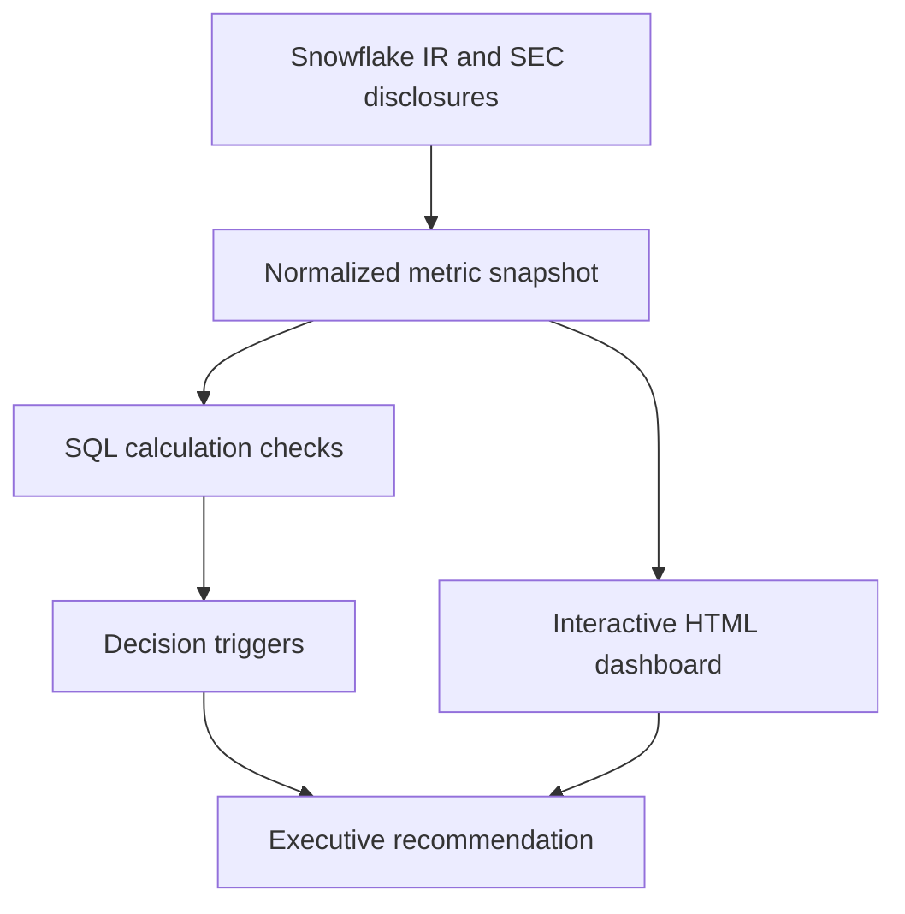

# Analytical architecture

This is a lightweight, decision-oriented architecture for a public-data case study. It keeps the data, calculation, interpretation, and presentation layers separate so a reviewer can inspect the reasoning.

## Layer responsibilities

| Layer | Repository artifact | Responsibility |
| --- | --- | --- |
| Source | README source links | Identify the primary public disclosures and reporting period. |
| Input | `artifacts/fy27-q2-metric-snapshot.csv` | Store the normalized quarterly metrics used in the case study. |
| Calculation | `technical/analysis.sql` | Reproduce sequential growth, year-over-year growth, indexed direction, and scenario math. |
| Interpretation | `technical/decision-logic.md` | Convert the signals into a baseline, triggers, and owners. |
| Presentation | `index.html` | Explain the result through an interactive executive-facing experience. |

## Production extension

For a live analytics environment, the next implementation would add a governed source table, scheduled ingestion, source-to-target tests, freshness checks, and a versioned forecast table. The dashboard would read the validated output rather than embed the snapshot directly.

The portfolio intentionally stops before claiming that production infrastructure exists.
