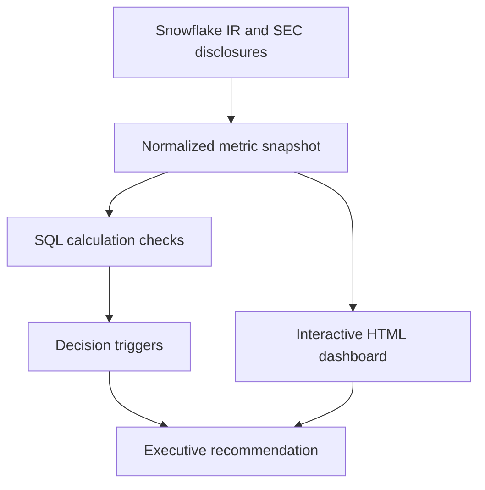

# Analytical architecture

This is a lightweight, decision-oriented architecture for a public-data case study. It keeps the data, calculation, interpretation, and presentation layers separate so a reviewer can inspect the reasoning.

## Layer responsibilities

| Layer | Repository artifact | Responsibility |
| --- | --- | --- |
| Source | README source links | Identify the primary public disclosures and reporting period. |
| Input | `artifacts/fy27-q2-metric-snapshot.csv`, `artifacts/rpo-recognition.csv` | Store quarterly metrics, rounded recognition shares, and their source. |
| Calculation | `technical/analysis.sql` | Reproduce growth, optional indexed comparisons, guidance arithmetic, and implied recognition amounts. |
| Interpretation | `technical/decision-logic.md` | Convert the signals into a baseline, triggers, and owners. |
| Presentation | `index.html` | Explain the result through an interactive executive-facing experience. |

## Production extension

The frontend currently embeds the snapshot in `index.html`; it does not query CSVs or run SQL at runtime. Native SVG renders the charts. Browser controls switch chart focus, reveal metric details, and compare hypothetical outcomes with inclusive guidance bounds. CSS adapts layouts and chart text to narrow screens and reduced-motion preferences.

For a live analytics environment, the next implementation would add a governed source table, scheduled ingestion, source-to-target tests, freshness checks, and a versioned forecast table. The dashboard would read the validated output rather than embed the snapshot directly.

The portfolio intentionally stops before claiming that production infrastructure exists.
